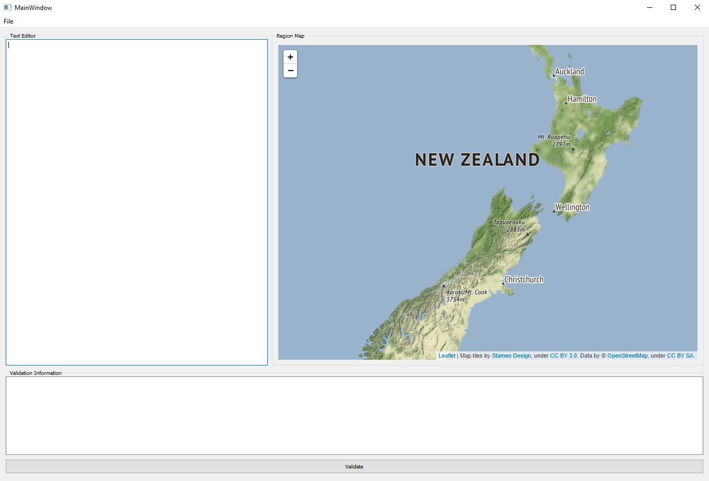
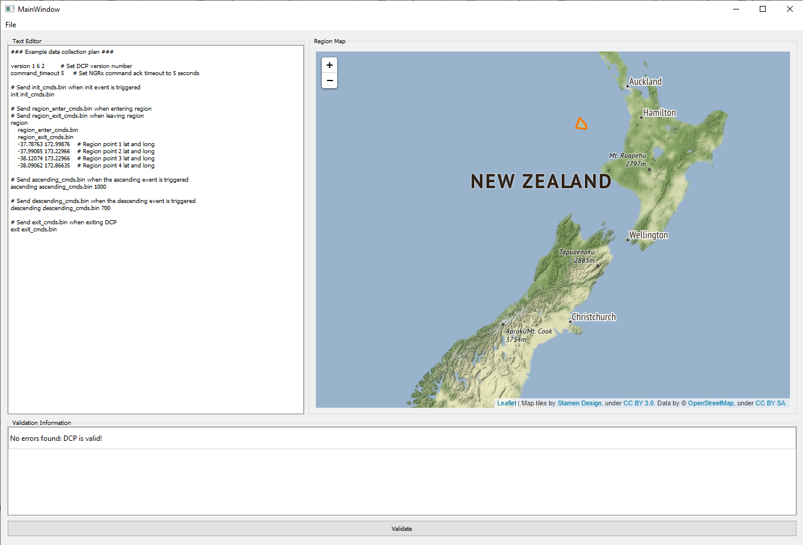
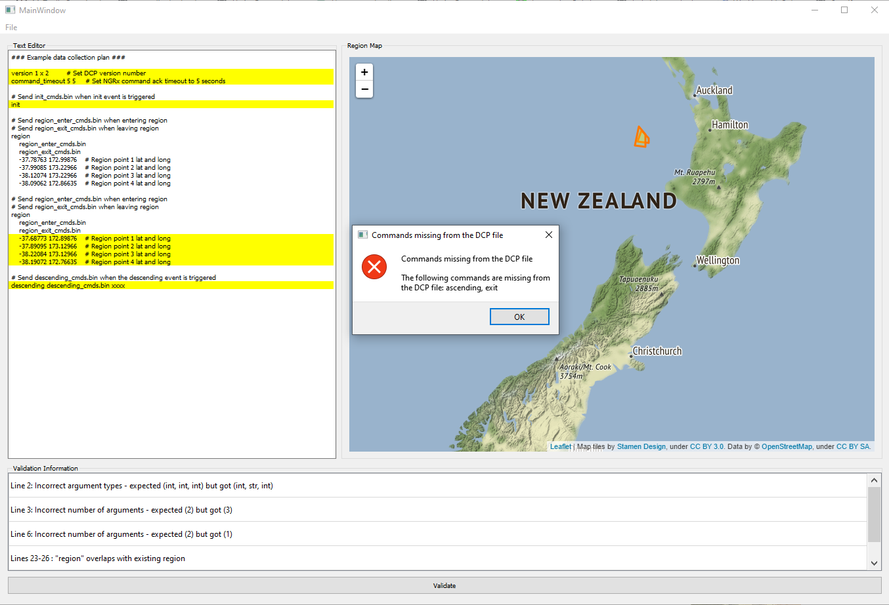

# SPOC-DCP-validator
GUI text editor to validate DCP files prior to use by the SPOC-Rongowai mission

Installation
============
The GUI runs in Python 3+ and requires the following modules: PyQt5, folium, shapely.

Download the code from GitHub (https://github.com/UoA-eResearch/SPOC-DCP-validator) either
as a Git clone command or as a ZIP file. By default the code will be placed in a folder
called SPOC-DCP-validator.

Running the GUI
===============
Open a terminal (Linux/OS) or cmd/anaconda prompt (Windows) and navigate to the SPOC-DCP-validator
folder. Once inside the folder run the following command `$ python main.py` which will
execute the GUI.

The GUI consists of 3 distinct sections:

* a basic text editor to write the DCP in
* a map of New Zealand that will display any regions defined in the DCP
* a debugging/validation section that displays any validity issues

DCP files can be loaded or saved using the `file` menu. The DCP-validator code comes
with a default DCP template that can be loaded in from the Default Load directory `DCP_files`.
An example of a valid DCP file can be seen below.

The text can be validated at any time by pressing the "Validate" button, which will then
highlight any detail any changes to the text that are required for a valid DCP file.
If there are missing mandatory commands these will prompt an error pop up when validating.

There are a number of validity checks for the DCP file including:

* Mandatory commands are present and not duplicated
* correct number of command arguments
* correct type of command arguments
* Region commands are correctly parsed
* Multiple region commands do not overlap

issues
======

If you encounter any issues using the DCP please raise an issue on GitHub: https://github.com/UoA-eResearch/SPOC-DCP-validator/issues

The GUI has been tested on Linux and Windows, but not Mac.
